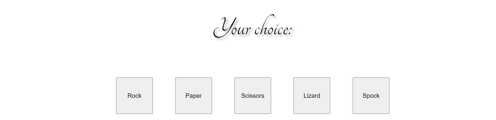
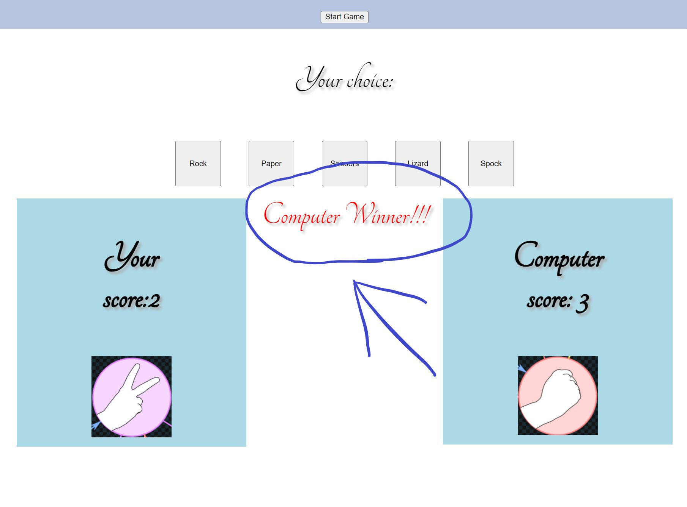
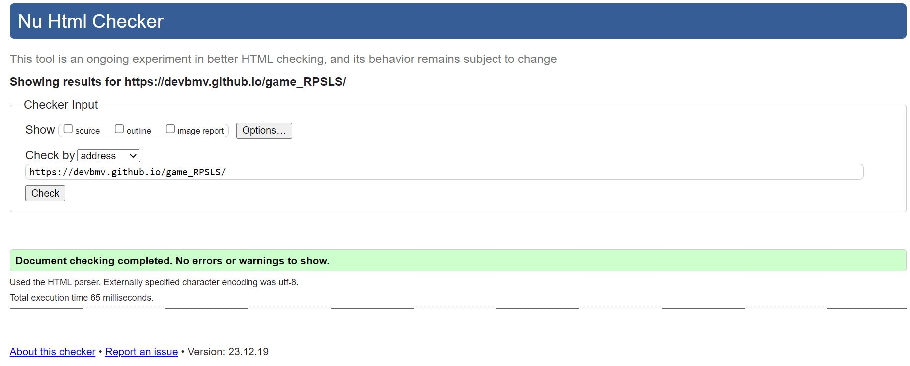
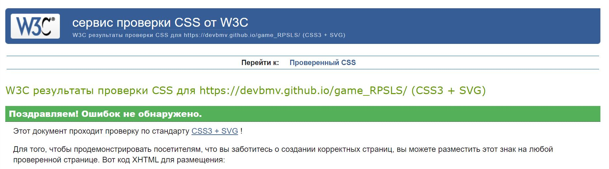
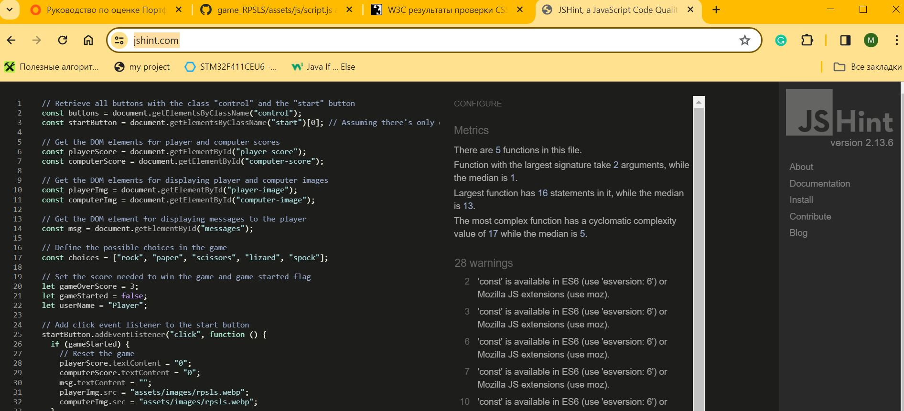
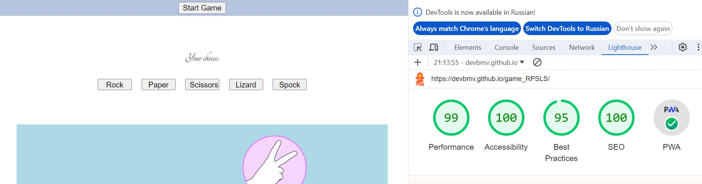

# Rock Paper Scissors Lizard Spock Web Game

  

## Overview

  

The main purpose of the application "Rock Paper Scissors Lizard Spock" is to offer an online, interactive version of the extended rock-paper-scissors game. This web application allows users to play against the computer in a game that enhances the traditional rock-paper-scissors by adding two more elements – Lizard and Spock – which introduces additional complexity and fun to the game. The game is designed to challenge the player's strategy and luck, and it provides a fun, engaging way to enjoy a classic game with a modern twist. With a user-friendly interface, score tracking, and dynamic interactions, it's tailored for users looking for an entertaining and quick-paced online game

  

## Key Features and User Benefits

  

### Feature 1: Start game BUTTON

The "Start Game" button in the "Rock Paper Scissors Lizard Spock" web application serves as the initial point of interaction for users to begin their gaming experience. When clicked, this button initiates the game, prompting the player to make their first choice among Rock, Paper, Scissors, Lizard, or Spock. Designed for ease of use, the button is prominently placed and clearly labeled, ensuring that even first-time visitors can understand and engage with the game effortlessly. This feature enhances the user experience by providing a simple and direct way to dive into the game without navigating through complex menus or instructions.

  

### Feature 2: Play buttons

This feature presents the player with a choice of five buttons, each labeled with an option from the game "Rock Paper Scissors Lizard Spock." The player is prompted to select one of these options as their move in the game. The buttons are straightforward and clearly labeled "Rock," "Paper," "Scissors," "Lizard," and "Spock," making it easy for players to understand their choices. This interactive element is central to the gameplay, allowing players to engage in the strategic selection process that determines the outcome of the game against the computer or another player. The clean and minimalist design focuses the player's attention on the important task at hand: making their choice to compete in a round of the game.

  

### Feature 3: Shows who is winner

This feature displays the outcome of a round in the "Rock Paper Scissors Lizard Spock" game. It clearly announces the winner of the round with a visual emphasis, in this case, highlighting that the computer has won. This announcement is coupled with the current scores for both the player and the computer, allowing players to easily track the progress of the game.

  

### Features Left to Implement

  

While the current version of "Rock Paper Scissors Lizard Spock" provides a robust and enjoyable gaming experience, I have several enhancements in mind for future releases:

  

-  **Multiplayer Mode:** Allowing users to play against friends or other online users instead of just the computer.

-  **Leaderboard System:** Implementing a global ranking system to track high scores and competitive play.

-  **User Accounts:** Adding the ability to create a user profile to save game progress and preferences.

-  **Mobile Optimization:** Ensuring the game is fully optimized for mobile devices for gaming on-the-go.

-  **Internationalization:** Providing multi-language support to cater to a global audience.

-  **Sound Effects & Music:** Integrating audio feedback and background music to enrich the gaming experience.

-  **Customization Options:** Offering users the ability to customize the game’s appearance and settings.

-  **In-Game Tutorials:** Adding tutorials or help sections to assist new players with the rules

  

Your contributions and suggestions for new features are welcome and appreciated.

## Testing

  

### Browser Compatibility

  

RPSLS web game is designed to be compatible with modern web browsers.

  

- Google Chrome

- AVG Secure Browser

- Microsoft Edge

  

### Responsiveness

  

To ensure a seamless user experience across various devices, The project was tested and is responsive on different screen sizes including desktops, laptops, tablets, and mobile devices.

  

### Manual Functionality Testing

  

Manually tested the functionality of RPSLS web game project by interacting with each component and feature. The buttons, links, and interactive elements respond appropriately. Checked for visual inconsistencies or layout issues.

  

### Validator Testing

  

- HTML

  

- No errors were returned when passing through the official:  

[HTML Validator](https://validator.w3.org/nu/?doc=https%3A%2F%2Fdevbmv.github.io%2Fgame_RPSLS%2F) 

 

  

- CSS

- No errors were found when passing through the official: 

[CSS Validator](https://jigsaw.w3.org/css-validator/validator?uri=https%3A%2F%2Fdevbmv.github.io%2Fgame_RPSLS%2F&profile=css3svg&usermedium=all&warning=1&vextwarning=&lang=ru) 

 

  

- JS

- During the development of "Rock Paper Scissors Lizard Spock" game, I used the JSHint online tool to ensure the quality and consistency of JavaScript code. Here are some insights and actions taken based on the feedback from JSHint:

  

- No errors were returned when passing through the official:  

[JS Validator](https://jshint.com/) 

 

  

### Metrics Provided by JSHint

- The code contains **5 functions**.

- The function with the largest signature takes **2 arguments**, while the median number of arguments is **1**.

- The largest function has **16 statements** in it, which indicates a moderate level of complexity and potential areas to refactor for maintainability.

- The most complex function has a value of 17, while the median across the codebase is 5. This suggests a particular function could benefit from simplification to improve readability and ease of maintenance.

  

### Warnings and Fixes:

JSHint has highlighted the use of ES6 syntax and features. We've configured JSHint to recognize ES6 by setting 'esversion: 6'. This allows us to use modern JavaScript features like const, let, and template literals, which enhance the code's readability and efficiency.

  

### Lighthouse Audit

  

RPSLS web game has been thoroughly tested using Google's Lighthouse audit tool to ensure high performance, accessibility, best practices, and search engine optimization. The results highlight the efficient design and responsive nature of the website, making it a reliable and user-friendly platform.

  

Here are the Lighthouse scores from latest audit:

  

-  **Performance**: 99

-  **Accessibility**: 100

-  **Best Practices**: 95

-  **SEO**: 100

-  **PWA**: Checked and confirmed

  

  

For a detailed breakdown and to understand more about what each metric means, you can view the full Lighthouse report by running the audit yourself in the Chrome browser's developer tools or visit the [Lighthouse website](https://developers.google.com/web/tools/lighthouse).

  
  

## Deployment

  

1.  **Step 1:** Open a terminal on your computer.

Clone the repository using the command:

Copy code "git clone https://github.com/devbmv/game_RPSLS.git"

2.  **Step 2:** Navigate to the Project Directory ,copy this code in your cmd: "cd game_RPSLS"

3.  **Step 3:** If you have a web server setup, place the project files in your server directory and navigate to the application using your

web server's address (e.g., http://localhost/game_RPSLS if using a local server).

  

If you do not have a web server, you can simply open the index.html file in your web browser by double-clicking the file or using the open command in the terminal:

Copy code "open index.html"

(This command may vary depending on your operating system; for example, you might use start index.html on Windows or xdg-open index.html on Linux.)

  

## External Code Attribution

The images used in the "Rock Paper Scissors Lizard Spock" game are sourced from the following external website:

  

-  **Source:** [The Big Bang Theory Wiki - Rock, Paper, Scissors, Lizard, Spock](https://bigbangtheory.fandom.com/wiki/Rock,_Paper,_Scissors,_Lizard,_Spock)

  

## Known Issues

  

During the development and deployment of the RPSLS game project, the following issues were identified and have been partially addressed. However, some issues may still persist on some devices:

  

### Accessibility Concerns:

-  **Contrast Ratios**: Efforts to improve text contrast are underway, enhancing readability across the site.

Planned Adjustments: We are in the process of making further improvements to enhance readability and user experience.

  

-  **Text Over**: Small range of screen sizes (width 800 to 980px) may have some text over the pictures.*Status : In Progres

  

## License

  

This project is released under an open source license. Please note that while the codebase itself is open source and free to use, modify, and distribute, it may include assets such as images or libraries that are subject to their own licenses. As such, it is the responsibility of the end-user to ensure that any use of these assets complies with their respective licenses.